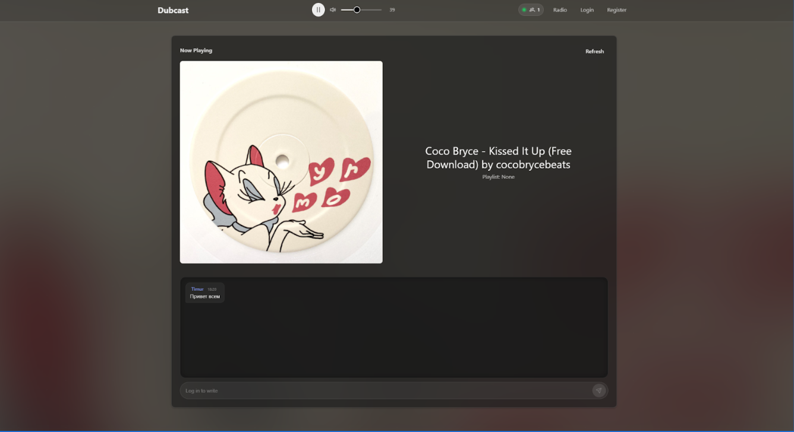
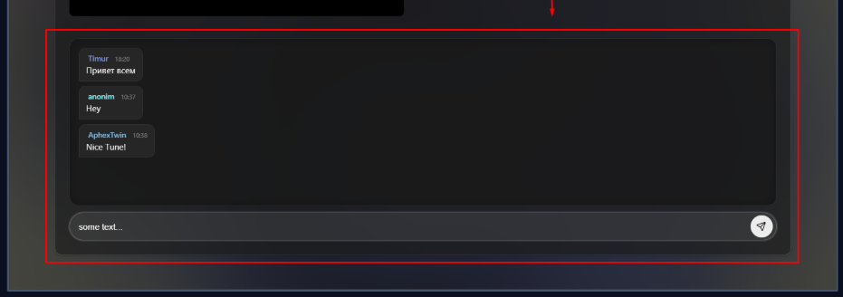

# 3. User Guide

This section explains how **end users** can use **Dubcast** (the listener web app).  
Dubcast is a “live radio” experience: everyone sees the same **Now Playing** state and can participate in real-time features like chat and the online listeners counter.

## Contents

- [Getting Started](index.md#getting-started)
- [Features Walkthrough](features.md)
- [FAQ & Troubleshooting](faq.md)

---

## Getting Started

### System Requirements

| Requirement | Minimum | Recommended |
|-------------|---------|-------------|
| **Browser** | Chrome 90+, Firefox 88+, Edge 90+, Safari 14+ | Latest stable version |
| **Internet** | Required (stream playback + API calls) | Stable broadband/Wi‑Fi |
| **Device** | Desktop or Mobile | Desktop for best UX |
| **Audio** | Working system output device | Headphones / speakers |

### Accessing the Application

1. Start backend (Docker Compose) so the API is available at `http://localhost:8089`
2. Start frontend dev server:

3. Open: `http://localhost:4200`

### First Launch

#### Step 1: Open the Radio page

1. Open the app in the browser
2. Go to **Radio** (`/radio`)
3. You will see:
    - **Now Playing** (track title + artwork)
    - **Online listeners** counter
    - Player controls

#### Step 2: Start playback

1. Click **Play**
2. Adjust **Volume**
3. Confirm audio output is correct

#### Step 3: Optional — Sign in for chat & profile

Dubcast supports **guest listening**, but some features require an account:

- Chat posting
- Editing your profile (bio/links)

1. Go to **Login** (`/login`) or **Register** (`/register`)
2. Complete the form
3. After successful login you will be redirected back to the Radio page

4. then you can wright to chat

---

## Quick Start Guide

| Task | How To |
|------|--------|
| Start listening | Open `/radio` → click **Play** |
| See current track | On `/radio`, check **Now Playing** block |
| Check who’s online | Look at **Online listeners** counter (updates live) |
| Read chat | Open chat panel on `/radio` |
| Send a chat message | Login → type message → **Send** |
| Update your profile | Login → open `/profile` → edit **bio/links** → save |

---

## User Roles

| Role | Permissions | Access Level |
|------|-------------|--------------|
| **Guest** | Listen to radio, view Now Playing, read chat (if enabled) | Public |
| **User** | All guest features + send messages + edit own profile | Authenticated (JWT) |
| **Admin** | Manages tracks/schedule/playlists via API documentation tools (Swagger UI) | Restricted (ROLE_ADMIN) |
