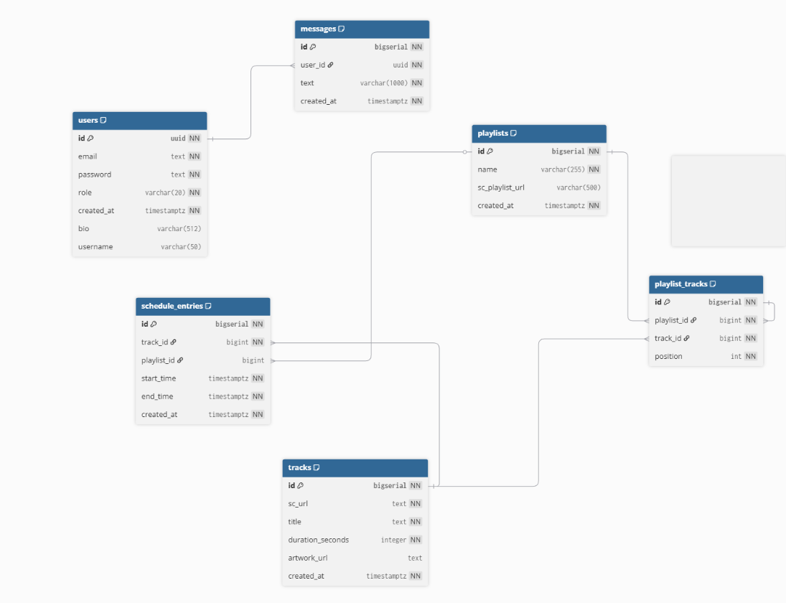

# Database Schema (Dubcast)

## Overview

| Attribute | Value |
|-----------|-------|
| **Database** | PostgreSQL |
| **Version** | 16 (via Docker image `postgres:16-alpine`) |
| **ORM** | Spring Data JPA (Hibernate) |
| **Migrations** | Liquibase (`src/main/resources/db/changelog/db.changelog-master.yaml`) |

## Entity Relationship Diagram (high level)


> Notes:
> - `schedule_entries` is the core “timeline” table.
> - `playlist_id` is optional: a schedule entry can reference a playlist, but still points to a primary `track_id`.

---

## Tables

### `users`

Stores authentication + profile data.

| Column | Type | Constraints | Description |
|--------|------|-------------|-------------|
| `id` | UUID | PK | User identifier |
| `email` | TEXT | NOT NULL, UNIQUE | Login identity |
| `password` | TEXT | NOT NULL | Password hash (e.g., BCrypt) |
| `role` | VARCHAR(20) | NOT NULL, CHECK | `ROLE_USER` / `ROLE_ADMIN` |
| `username` | VARCHAR(50) | UNIQUE, NULLABLE | Public nickname |
| `bio` | VARCHAR(512) | NULLABLE | Profile bio |
| `created_at` | TIMESTAMPTZ | NOT NULL, DEFAULT `now()` | Creation timestamp |

**Indexes**
- Unique indexes: `users(email)`, `users(username)`.

---

### `tracks`

Radio catalog (imported from SoundCloud).

| Column | Type | Constraints | Description |
|--------|------|-------------|-------------|
| `id` | BIGINT | PK | Track identifier |
| `sc_url` | TEXT | NOT NULL, UNIQUE | SoundCloud URL |
| `title` | TEXT | NOT NULL | Track title |
| `duration_seconds` | INT | NOT NULL, CHECK (`> 0`) | Duration |
| `artwork_url` | TEXT | NULLABLE | Cover image URL (may be missing) |
| `created_at` | TIMESTAMPTZ | NOT NULL, DEFAULT `now()` | Creation timestamp |

**Indexes**
- Unique index: `tracks(sc_url)`.

---

### `playlists` (optional domain)

Groups tracks for scheduling or reuse.

| Column | Type | Constraints | Description |
|--------|------|-------------|-------------|
| `id` | BIGINT | PK | Playlist identifier |
| `name` | VARCHAR(255) | NOT NULL | Playlist name |
| `sc_playlist_url` | VARCHAR(500) | NULLABLE | SoundCloud playlist URL (optional) |
| `created_at` | TIMESTAMPTZ | NOT NULL, DEFAULT `now()` | Creation timestamp |

---

### `playlist_tracks`

Ordered items inside playlists.

| Column | Type | Constraints | Description |
|--------|------|-------------|-------------|
| `id` | BIGINT | PK | Row identifier |
| `playlist_id` | BIGINT | NOT NULL, FK → `playlists(id)` | Owning playlist |
| `track_id` | BIGINT | NOT NULL, FK → `tracks(id)` | Track reference |
| `position` | INT | NOT NULL, UNIQUE(playlist_id, position) | Order within playlist |

**Indexes**
- `playlist_tracks(playlist_id)`
- `playlist_tracks(track_id)`
- Unique: `(playlist_id, position)`

---

### `schedule_entries`

Defines the global radio timeline (time-driven “Now Playing”).

| Column | Type | Constraints | Description |
|--------|------|-------------|-------------|
| `id` | BIGINT | PK | Entry identifier |
| `track_id` | BIGINT | NOT NULL, FK → `tracks(id)` | Main track for the time slot |
| `playlist_id` | BIGINT | NULLABLE, FK → `playlists(id)` | Optional playlist context |
| `start_time` | TIMESTAMPTZ | NOT NULL | Slot start |
| `end_time` | TIMESTAMPTZ | NOT NULL, CHECK (`end_time > start_time`) | Slot end |

**Integrity rule (critical): no overlaps**
- Implemented at DB-level using a trigger/function (or equivalent) that rejects overlapping `tstzrange(start_time, end_time)` intervals.

**Indexes**
- Time-range support: `(start_time, end_time)`
- FKs: `schedule_entries(track_id)`, `schedule_entries(playlist_id)` (implicit/explicit)

---

### `messages`

Chat message history (persistent).

| Column | Type | Constraints | Description |
|--------|------|-------------|-------------|
| `id` | BIGINT | PK | Message identifier |
| `user_id` | UUID | NOT NULL, FK → `users(id)` | Author |
| `text` | VARCHAR(1000) | NOT NULL | Message body |
| `created_at` | TIMESTAMPTZ | NOT NULL | Message time |

**Indexes**
- Pagination/order: `messages(created_at)`

---

## Relationships

| Relationship | Type | Description |
|--------------|------|-------------|
| `users` → `messages` | One-to-Many | One user writes many messages |
| `tracks` → `schedule_entries` | One-to-Many | A track can appear in many schedule entries |
| `playlists` → `playlist_tracks` | One-to-Many | A playlist contains ordered track items |
| `tracks` → `playlist_tracks` | One-to-Many | A track can be included in many playlists |
| `playlists` → `schedule_entries` | One-to-Many (optional) | A schedule entry may reference a playlist |

---

## Migrations

Schema changes are applied via Liquibase.

| Item | Description |
|------|-------------|
| Master changelog | `src/main/resources/db/changelog/db.changelog-master.yaml` |
| Organization | Versioned folders (e.g., `V1.x`, `V2.x`) included from master |
| Apply | Runs automatically on app start when `spring.liquibase.enabled=true` |

---

## Seeding (test/demo data)

Test/demo records may be added via Liquibase seed changesets (environment-dependent).

**How to verify**
- Start the stack and query key tables:
```bash
# enter the DB container (compose service name may differ)
docker compose exec servicesite-db psql -U "$DB_USERNAME" -d "$DB_NAME" -c "SELECT count(*) FROM tracks;"
```

If counts are zero, the system still works — you can create data through the admin API (Swagger UI) by adding tracks and schedule entries.

